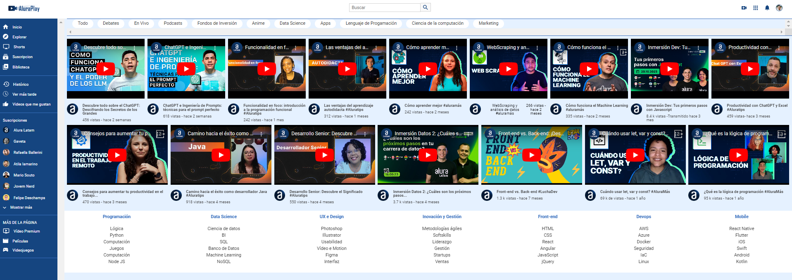

<h1 align="center"> PROYECTO ALURA PLAY ONE - ALURA </h1>

# Curso de CSS, Flexbox y Layouts responsivos | Front End G6 - ONE 

👩‍💻 💻 Desarrollo del proyecto Alura Play: "Plataforma de videos"   

Construcciòn del proyecto Alura Play, es una plataforma de videos que cuenta con un encabezado, 
un menú lateral, una sección superior, tenemos la sección de videos y un pie de página. 
El proyecto se realizo trabajando con lo que es Flexbox, también responsividad y algunas propiedades de CSS.

     

### ¡Bienvenido a la Plataforma de videos de Alura Play!

---

     

 
  ❤️ ESTADO: Finalizado
 

## 🔎 Deploy

  <h3>
    <a href="https://github.com/bety2022/Proyecto-Alura-Play/blob/main/index.html" >
      🔗 Visitar Plataforma de videos de Alura Play
    </a>

 

## 🛠️ Herramientas implementadas 
  - Layouts
  - Flexbox
  - CSS
  - HTML
  - JavaScript
  - Git || GitHub || GitHub Pages
  - Figma

    

 

 

## 📧 Contacto
¿Tienes un proyecto en mente? Conectémonos y hagamos que las cosas sucedan! Puedes escribirme a carolinalopezdatascientist@gmail.com o seguirme en [LinkedIn](https://www.linkedin.com/in/carolina-lopez-430208106/).
  
